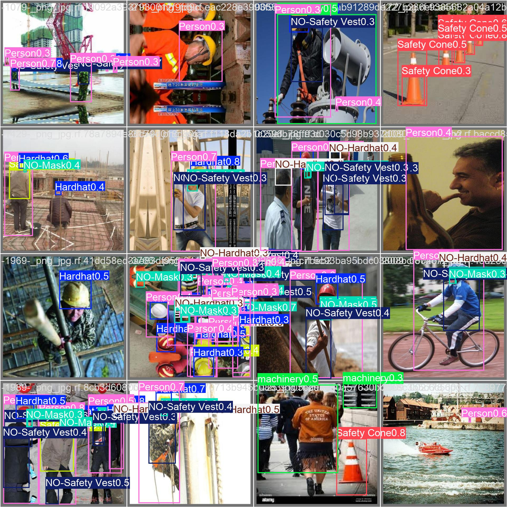

# Twin-Demo — 산업 안전 PPE 비전

> 건설현장·공장 영상에서 작업자의 안전장구(헬멧·마스크·조끼) 착용 여부를 검출·추적하고, 미착용을 실시간 경보하는 컴퓨터 비전 데모.

## 문제 / 해결

- **문제:** 산업 현장에서 안전장구 미착용은 중대 재해로 직결되지만, 사람이 모든 CCTV를 동시에 감시하기 어렵다.
- **해결:** YOLO11 로 PPE 10종을 검출하고, ByteTrack 으로 작업자에게 일관된 ID를 부여해 "누가 얼마나 오래 위반 중인지"까지 추적한다. 미착용(NO-*) 감지 시 화면 상단에 빨간 경보를 합성한다.

## 핵심 결과

| 지표 | 값 |
|---|---|
| **mAP@50** | **0.549** |
| mAP@50-95 | 0.273 |
| Precision / Recall | 0.636 / 0.556 |
| 클래스 | 10종 (Hardhat·Mask·Safety Vest·Safety Cone·Person·machinery·vehicle + NO-Hardhat·NO-Mask·NO-Safety Vest) |
| 추적 | ByteTrack (작업자별 ID·지속 위반 구분) |

- **강점 클래스:** Mask 0.765 · Safety Cone 0.735 · Hardhat 0.686 · machinery 0.677
- **약점 클래스:** vehicle 0.284 · NO-Hardhat 0.342 · NO-Safety Vest 0.355

증빙: [`docs/metrics/`](docs/metrics/) — PR 곡선 · confusion matrix · per-class CSV



## V1 / V2 — 정직한 현황

이 프로젝트의 강점은 높은 mAP 자체가 아니라 **약점을 진단하고 가설로 실험을 설계하는 과정**이다.

**가설:** 부정형(NO-*) 클래스가 낮은 건 모델 용량 문제가 아니라 *'없음'이 본질적으로 어려운 판정*이기 때문이다. '헬멧 있음'은 객체를 찾으면 되지만 'NO-Hardhat'은 머리에 헬멧이 없음을 맥락으로 추론해야 한다. 실측(NO-Hardhat 0.342, NO-Safety Vest 0.355)이 이를 뒷받침한다.

| 항목 | V1 (학습 완료) | V2 (설계 완료, 미학습) | 의도 |
|---|---|---|---|
| 모델 | yolo11n | yolo11s | 표현력 ↑ |
| 입력 크기 | 640 | 832 | 작은 객체(NO-*) 강세 |
| augmentation | 기본 | mosaic + mixup + hsv + scale + degrees | 부정형 다양성 확보 |
| 클래스 가중치 | 균등 | cls=0.7 (부정형 강조) | 약점 클래스 학습 집중 |
| 옵티마이저 | 기본 | AdamW + cosine LR + warmup | 수렴 안정화 |

> **정직 표기:** V2 는 가설 기반 실험 설계까지 완료된 상태이며, 학습 실행은 GPU(Colab T4/RunPod) 확보 후 진행 예정이다. 미학습을 숨기지 않는 것이 이 카드의 핵심이다.

## 기술 스택

YOLO11n/s · Ultralytics · ByteTrack · Streamlit · Plotly · Weights & Biases · OpenCV

## 설치 & 실행

[uv](https://docs.astral.sh/uv/) 로 의존성을 관리한다.

```bash
cd app
uv sync
uv run streamlit run app/streamlit_app.py
```

기본 가중치는 저장소에 포함된 `app/models/best_v1.pt` 를 자동으로 사용한다(없으면 학습 산출물 디렉토리로 fallback). 디바이스는 CUDA → MPS → CPU 순으로 자동 선택되며, 사이드바에서 수동 변경할 수 있다.

GPU 학습은 Colab 노트북 [`app/colab/train_v2_colab.ipynb`](app/colab/train_v2_colab.ipynb) 참고.

## 프로젝트 구조

```
twin-demo/
├── app/
│   ├── app/
│   │   ├── __init__.py
│   │   ├── inference.py        # YOLO11 + ByteTrack 추론 엔진 (PPEDetector, draw_boxes)
│   │   └── streamlit_app.py    # 4탭 데모 UI (이미지 / 영상+추적 / 2D 트윈 / 학습결과)
│   ├── scripts/
│   │   ├── train_baseline.py   # V1 학습 (yolo11n)
│   │   ├── train_v2.py         # V2 설계 (yolo11s · 832 · aug 강화)
│   │   ├── train_smoke.py      # 파이프라인 스모크 테스트
│   │   ├── get_dataset.py      # Roboflow 데이터셋 다운로드
│   │   ├── draw_boxes.py       # 단일 영상에 박스 렌더링
│   │   └── artifacts.sh        # 무거운 산출물(footage/datasets/weights) 링크 관리
│   ├── colab/train_v2_colab.ipynb
│   ├── models/best_v1.pt       # V1 학습 가중치 (저장소 포함)
│   ├── pyproject.toml · uv.lock
│   └── yolo11n.pt · yolo11s.pt
├── docs/metrics/               # V1 검증 차트 (PR곡선 · 혼동행렬 · per-class)
├── LICENSE
└── README.md
```

> 영상(footage ~200MB)·데이터셋(construction-ppe 2,603장)은 용량 문제로 저장소에서 제외했다.
> 재현 시 `cd app && uv run python scripts/get_dataset.py` 로 Roboflow 에서 받는다.

## 데이터셋

- **Construction Site Safety v27** (Roboflow Universe, CC BY 4.0) — train 2,603 / valid 114 / test 82
- 10 클래스 (위 표 참고)

## 한계 & 다음

- **한계:** 부정형(NO-*)·vehicle 클래스 정확도가 낮다. V2 는 아직 미학습 상태다.
- **다음:**
  1. GPU 확보 후 `scripts/train_v2.py` 실행 → 가설(부정형 강화 설정) 검증.
  2. V1 대비 NO-* 클래스 mAP 개선폭 측정.
  3. 실시간 스트림(RTSP) 입력 및 경보 알림 연동.

## License

[MIT](LICENSE) © 2026 이재환 (Jaehwan Lee)
